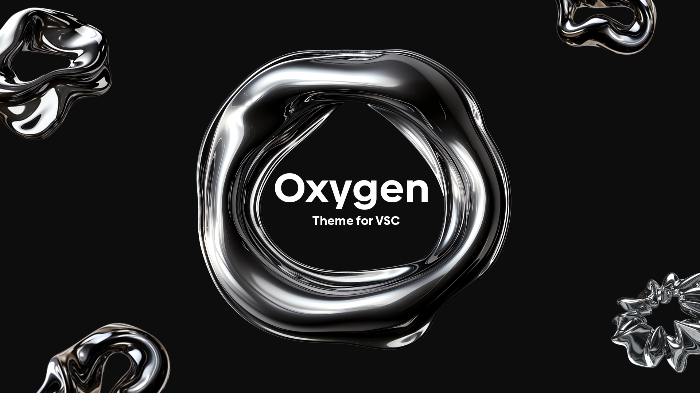
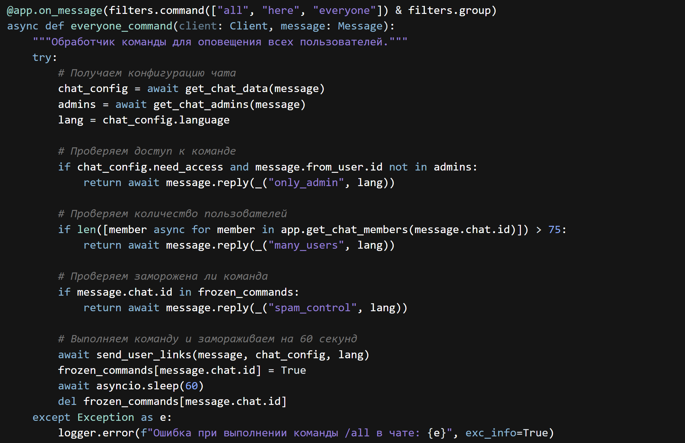

# Oxygen Theme

> Like a breath of fresh air in a sea of code — Introducing Oxygen Theme

**A Visual Studio Code color theme in calming blue and violet tones**, inspired by CodeSandbox's aesthetic. Perfect for long coding sessions, combining eye comfort with stylish design.

## Features  
- **Harmonious Palette**: Blend of deep violet accents and soft blue backgrounds  
- **Optimized Readability**: Clear syntax element differentiation  
- **Universal Support**: Works great with popular languages

## Installation  
1. Open VS Code Extensions Marketplace  
2. Search for **"Oxygen Theme"**  
3. Click `Install`  
4. Activate via `Ctrl/Cmd + Shift + P` → "Preferences: Color Theme" → "Oxygen"

> As a temporary solution, while the theme is not in the VSC store, I suggest you download this archive and move it to `C:\Users\User\.vscode\extensions.` After that, you will find it in the extensions window.

Support
Found a bug or have suggestions?
[Open an issue](https://github.com/Merrcurys/Oxygen-Theme/issues)